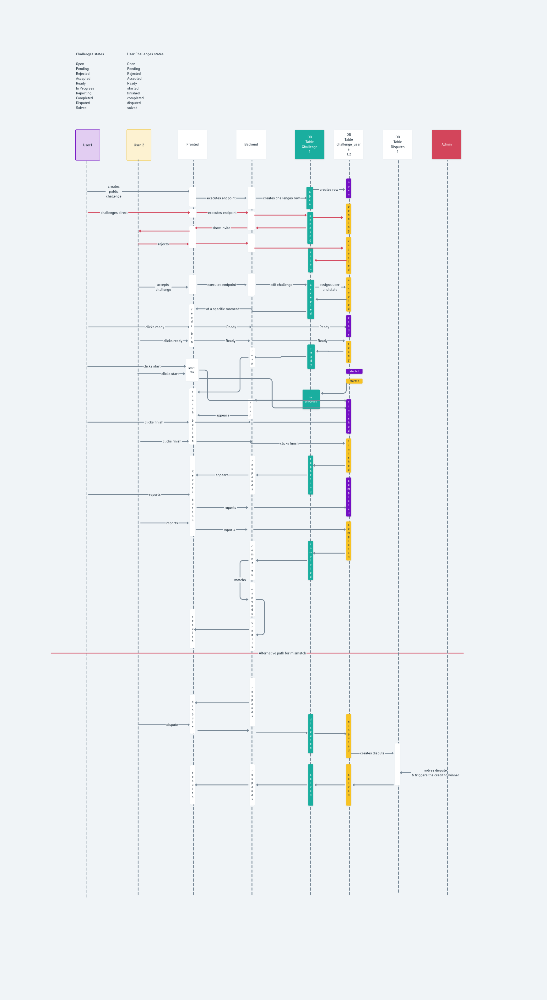

# Backend

This is the repo that contains the backend of the application written in Python and Flask

## Install

In order to install you must

- Clone the repository using `git clone git@github.com:PlayTopDog/application_backend.git`
- Create a new project in firebase if you don't already have one
- In the config of firebase go to __Project Overview -> General__ and scroll to the bottom
- You will find a firebase config like the following:
```js
const firebaseConfig = {
  apiKey: "xxx",
  authDomain: "xxx",
  databaseURL: "xxx",
  projectId: "xxx",
  storageBucket: "xxx",
  messagingSenderId: "xxx",
  appId: "xxx",
  measurementId: "xxx"
};
```


```
- Enable email and password sign in — Go to Authentication -> Sign-In-Method and enable sign in with email and password
- Export Admin SDK private key — Go to Project Overview -> Service Accounts -> Firebase Admin SDK, then select Python as the language and click generate new private key and your file will download. Do NOT share this file or upload it anywhere it allows total read and write access of your Firebase project. Save it somewhere in your computer with the name `fbAdminConfig.json`
- Create a `.env` file with this.
```
```
DATABASE_URI=""
APP_SECRET_KEY=""
JWT_SECRET_KEY=""
APPLICATION_SETTINGS=default_config.py
AWS_ACCESS_KEY_ID=""
AWS_ACCESS_KEY_SECRET=""
AWS_BUCKET=""
SENDBIRD_API_TOKEN=""
SENDBIRD_API_URL=""
TWILIO_ACCOUNT_SID=""
TWILIO_AUTH_TOKEN=""
TWILIO_FROM_PHONE=""
MAILCHIMP_API_KEY=""
```
- Also create a `.env.test` file that's gonna be used for testing. It's recommended that the `DATABASE_URI` is different for testing
- Input your AWS app credentials in the env files
- Get a sendbird account and [get an api token and an api URL](https://sendbird.com/docs/chat/v3/platform-api/getting-started/prepare-to-use-api), this is going to be used internally for the chat functionality which is located here `app/resources/chat.py`
- [Get a mailchimp api key](https://eepurl.com/dyijVH) and then input it on the `MAILCHIMP_API_KEY` environment variable. This is used to send emails here `app/utils/email.py`
- Get a [twilio account](https://www.twilio.com) and from its dashboard [get an auth token, an account sid](https://support.twilio.com/hc/en-us/articles/223136027-Auth-Tokens-and-How-to-Change-Them) and a telephone that's going to be used to send messages. Internally we use the Twilio client to make requests to the API. You can see the implementation here `app/sms/utils_.py`. Then you'll be able to set up the environment variables `TWILIO_ACCOUNT_SID` `TWILIO_AUTH_TOKEN` and `TWILIO_FROM_PHONE`

## Crons

There are three cron tasks running the app.

### send_sms_upcoming_challenges

This cron task is ran every minute to send messages indicating that a challenge is about to start

Here's the implementation `app/sms/main.py`

### fix_challenges_one_result

This cron task is ran every 5 minutes to award the credits of a challenge in which only a single result has been proxy_set_header

You can see the implementation here `app/challenge_maintenance/fix_challenges.py`

### set_challenges_closed

This cron task is ran every 5 minutes to set all challenges that are open to closed if they have been open for more than a day.

The implementation can be checked here `app/challenge_maintenance/set_challenges_closed.py`

## Other commands

### set is admin

In order to set a user as an admin you must specify the username and whether their admin status is True or False (`t` or `f`)

In the root directory of the project execute
```sh
FLASK_APP="app/app" flask set_is_admin [username] [admin status]
```

For example

```sh
FLASK_APP="app/app" flask set_is_admin phil f
```

## Running the app

For the first run:
``` sh
make up-build
```

For regular executions
``` sh
make up
```


## Tests

Tests are located in the `app/tests` directory.

We have three types of tests

### System

These tests make sure endpoints work correctly, they are located in the `app/tests/system` folder

### Integration

Tests that use a test database to make sure that queries to this database work correctly. This is used for challenges, games and user games

They are located in the `app/tests/integration` folder

### Unit

Unit tests for asserting that certain claims are in force in user endpoints


To test
``` sh
make test
```


For more commands, check the `Makefile`

## Status transitions

Whenever a challenge is created, and it's modified. It can have the following statuses



## More development stuff

With the server up, you can visit this sites:

- PGAdmin: To check the database locally without disrupting your local DBs http://localhost:8081
- MailHog: To check sent mails http://localhost:8025
- Dozzle: To check Docker logs separately http://localhost:999

# Production

Production deploys itself whenever `develop` is updated. The URL is http://3.15.194.120/

## To run a new production environment in AWS:

You will need:
-   A new AWS EC2 VPS with [docker](https://docs.docker.com/engine/install/ubuntu/) and [docker-compose](https://docs.docker.com/compose/install/)
-   A new RDS with PostgreSQL

### Deployment
1.  Populate your .env file in the root of the application
2.  Run with the makefile:

``` sh
$ make prod
```

And the docker image will create itself, populate, migrate and serve.
